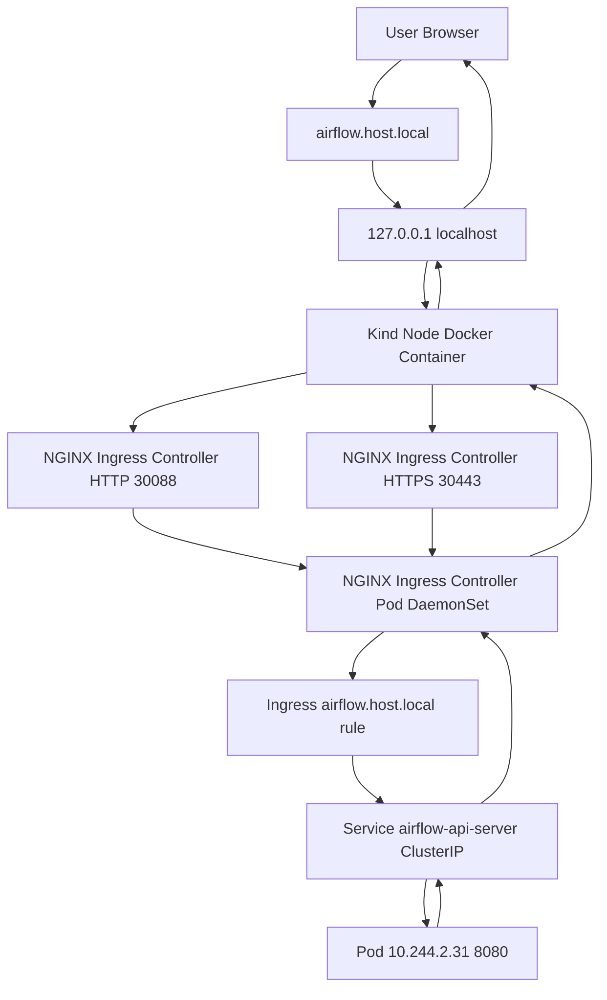

# Kubernetes

# WSL install
Om argo correct te laten draaien moeten volgende zaken nagekeken en gecorrigeerd worden:
```bash
cat /proc/sys/fs/inotify/max_user_watches
cat /proc/sys/fs/inotify/max_user_instances
```

Typische defaults die te laag zijn
- max_user_watches: 8192
- max_user_instances: 128

Corrigeer door:

```bash
echo "fs.inotify.max_user_watches=524288" | sudo tee -a /etc/sysctl.conf
echo "fs.inotify.max_user_instances=512" | sudo tee -a /etc/sysctl.conf
sudo sysctl -p
```

## Docker
```bash
sudo snap install docker
```

## kind
```bash
cd && [ $(uname -m) = x86_64 ] && curl -Lo ./kind https://kind.sigs.k8s.io/dl/v0.31.0/kind-linux-amd64
sudo chmod +x kind && sudo mv kind /usr/local/bin/kind
```

## kubectl
```bash
curl -LO "https://dl.k8s.io/release/$(curl -L -s https://dl.k8s.io/release/stable.txt)/bin/linux/amd64/kubectl"
sudo install -o root -g root -m 0755 kubectl /usr/local/bin/kubectl
```

## helm
```bash
curl https://raw.githubusercontent.com/helm/helm/main/scripts/get-helm-4 | bash
```

## helmfile
```bash
curl -o helmfile.tar.gz https://github.com/helmfile/helmfile/releases/download/v1.4.1/helmfile_1.4.1_windows_amd64.tar.gz
tar -xvzf helmfile.tar.gz
sudo chmod +x helmfile
sudo mv helmfile /usr/local/bin/helmfile

sudo helmfile init
```

## Start cluster

Using kind:
```bash
kind create cluster --config kind/cluster.yml --name ...
```

With registry:
```bash
./kind/create-local-cluster.sh
```

## Deploy using helm and kubectl

```bash
mkdir -p <folder>/generated
helm template -n <namespace> <name> . > <folder>/generated/manifests.yaml
kubectl apply -f generated/manifests -n <namespace>
```

| Folder                | Namespace | Name                     |
|-----------------------|-----------|--------------------------|
| storage               | storage   | mission-control-storage  |
| rest-api-kubernetes   | rest-api  | mission-control-rest-api |
| argo-setup-kubernetes | argo      |                          |
| argo-kubernetes       | argo      |                          |


# Airflow - small example using nginx
See nginx
```bash
bash ingress-nginx/start.sh
```

Adapt the needed here (check as well the exercise below):
```bash
bash airflow/start.sh
```

## DNS routing (DNS to your localhost)
if on windows :
C:\Windows\System32\drivers\etc\hosts
Add an entry into that to ensure proper routing
127.0.0.1 airflow.host.local

### Networking


#### Airflow exercise
setting up git-sync feature by including a secret + configuring using helm values.

[the reference](https://airflow.apache.org/docs/helm-chart/stable/manage-dag-files.html#using-git-sync)

First create a private repo.
```bash
ssh-keygen -t rsa -b 4096 -C "your_email@datashift.eu"
```

Add the public key to your private repo under Settings > Deploy keys!